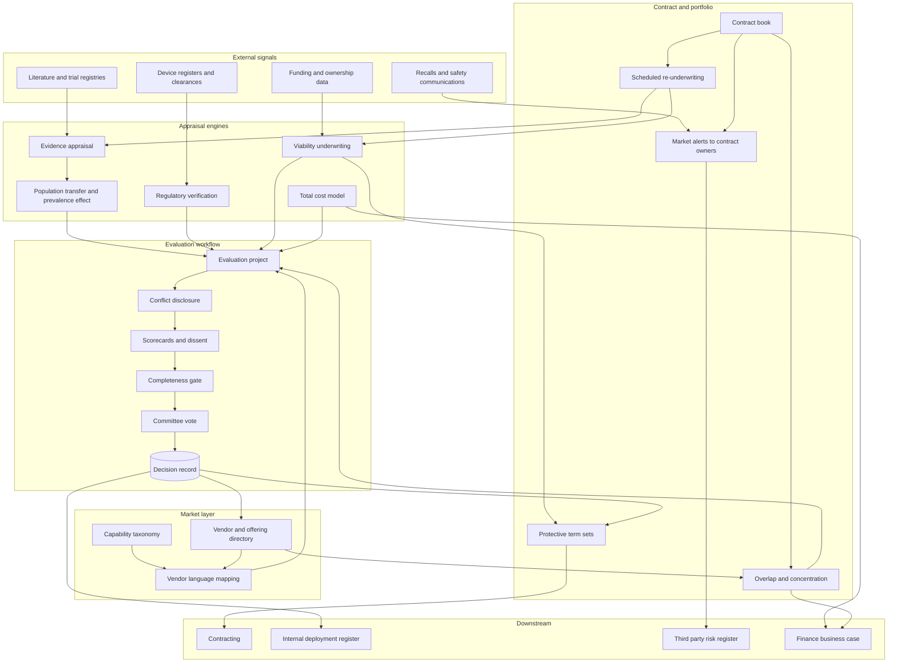

# Evidura

**Source:** `ai-in-health/Accenture-Chart-The-AI-Health-Market-Explosive-Growth/`
**Domain:** `ai-health`
**One-liner:** A health-AI underwriting system for payers, providers, and purchasing coalitions that appraises what a vendor's algorithm actually proves for the buyer's own population, scores whether the vendor survives the contract term in a consolidating market, and converts both into the contract terms and the go or no-go decision.
**Wedge:** Strategic sourcing and clinical evaluation committees at health plans and integrated delivery networks running 15–60 health-AI evaluations a year, where the shortlist is assembled from conference conversations and the legal template is a generic software agreement with no clause for a model that degrades or a vendor that is acquired.
**Positioning:** Vendor underwriting for algorithms, not an analyst subscription and not a ratings site. Ratings tell a buyer what peers think of a product today; Evidura tells this buyer whether the evidence transfers to their population, whether the seller will exist in year three of a five-year contract, and which specific contractual protections to demand before signing — then keeps re-underwriting as the market consolidates underneath the contract.

## Market research synthesis

### Thesis from source

The source is one exhibit with one claim: health AI market size grows from $600M in 2014 to $6.6B in 2021 — stated as 11x — at a compound annual growth rate of 40%, and the caption attributes the trajectory in part to acquisitions of AI startups that are "rapidly increasing." That is a supply-side market-formation statement, not a statement about delivered clinical or financial value. Read strictly, it says the population of sellers and the capital flowing to them is expanding roughly an order of magnitude in seven years, with consolidation named as a feature of the expansion rather than a later phase of it.

The buyer-side consequence follows from a simple mismatch of clocks. A health plan or health system takes nine to eighteen months from evaluation to production for anything that touches clinical workflow or claims adjudication, and then signs a three-to-five-year agreement with an implementation cost that is often a multiple of the first-year licence. A category compounding at 40% with active acquisition is populated overwhelmingly by venture-backed sellers who are pre-profitability, dependent on a next round, and plausible acquisition or shutdown candidates inside the buyer's first contract term. The dominant risks in the purchase are therefore not the risks the procurement process is built to test. Feature comparison, security questionnaires, and reference calls all assume a durable counterparty selling a stable product. In this market the two decisive unknowns are whether the algorithm's published performance survives contact with the buyer's population, and whether the seller survives long enough to honour integration, retraining, support, and post-market obligations.

Explosive entry produces a second, less discussed problem: vocabulary. When a category grows 11x in seven years, sellers describe overlapping functions in incompatible language — one calls it care-gap closure, another risk stratification, another population intelligence — and the buyer cannot reliably tell whether two products on the shortlist are competitors, complements, or the same engine sold twice. Enterprises accordingly buy the same job repeatedly across service lines and regions without noticing. A stable functional taxonomy, owned by the buyer rather than by the sellers, is therefore a prerequisite instrument: it is what makes comparison, overlap detection, and category-level spend visibility possible at all.

The third implication concerns evidence transfer, and it is the part a demo cannot show. An algorithm's reported discrimination is a property of the population it was measured on. Prevalence differences change positive predictive value even when discrimination is unchanged, so a model validated on an academic centre's admitted population behaves differently in a community ambulatory setting; coding, documentation, and workflow differences shift the inputs; and calibration is the property that fails first and is reported least often. A buyer that reads a vendor's area-under-curve figure as a promise about their own patients has not evaluated the product. Underwriting means asking what the study population was, how far the buyer's population sits from it, what prevalence does to the operating point, whether the regulatory clearance covers the population and workflow the buyer intends, and what the vendor commits to when performance in the buyer's setting falls short. None of that is a feature question, and all of it is decidable before signature.

### Buyer & economic model

- **Primary buyer:** on the provider side, the Chief Procurement or Strategic Sourcing Officer partnered with the Chief Medical Information Officer; on the payer side, the VP of Clinical Innovation or Chief Analytics Officer partnered with third-party risk management. Purchasing coalitions and group purchasing organisations buy the same capability to underwrite on behalf of members.
- **Users:** sourcing category managers, clinical evaluators drawn from medicine, pharmacy, and nursing informatics, security and integration architects, legal and contracting, actuarial or finance analysts, third-party risk and vendor management, and the committee that ultimately votes.
- **Budget owner / value metric:** the sourcing and vendor-management budget, funded by the avoided cost of failed and duplicated purchases. The value metric is decision quality made measurable: share of evaluations that reach a documented decision, evaluation cycle time, protective contract terms secured, spend released by consolidating overlapping contracts, and the count of contracts disrupted by a vendor event that the buyer had already priced and prepared for.
- **Competing status quo:** analyst subscriptions and peer reference calls, a request-for-information spreadsheet, a pilot-first habit in which a small paid pilot substitutes for evaluation and then becomes the default purchase, a generic software contract template, and an innovation function whose pilots rarely convert. None of these produce a viability read on the seller or a transfer assessment on the evidence, which is why the same organisation is surprised twice by the same class of failure.

### Domain constraints

- **Regulatory / trust / safety:** the regulatory status of an offering must be verified against the register rather than taken from marketing material, and the clearance's intended use must be compared with the workflow the buyer actually plans, because a cleared device deployed outside its indicated population or role is off-label use the buyer assumes. Where an offering is marketed as clinical decision support outside the device boundary, the reasoning has to hold up under the criteria that place it there. Post-market surveillance and malfunction reporting duties must be allocated in the contract, not left ambiguous between buyer and seller.
- **Data sensitivity:** the evaluation is itself a regulated data activity. Any bench test, silent trial, or sample-based assessment using patient records requires a lawful basis under HIPAA and, for European operations, a special-category basis under GDPR, with a business associate agreement or equivalent processor terms in place before a single record moves. A pre-purchase "proof of concept" that ships identifiable data to an early-stage vendor's cloud is a disclosure with breach exposure attached, and de-identified test extracts must be assessed for re-identification risk given the small cohorts typical of pilots.
- **Change-management realities:** clinical evaluators have no protected time, so a scoring instrument that takes a physician six hours will be completed by nobody or by a delegate; the evidence appraisal must therefore be pre-digested with the clinical judgement calls isolated. Sourcing cannot enforce a taxonomy that clinical leaders did not help write. Conflicts of interest are routine rather than exceptional — evaluators hold advisory roles, equity, and research funding from candidate vendors — so disclosure must be a mandatory field in the workflow rather than an ethical expectation. And a decision that says no must be as easy to record as one that says yes, or the register fills only with purchases.

## Business requirements

- BR-1: The organisation must maintain a functional taxonomy of health-AI capabilities defined by the clinical or financial job performed, owned internally and mapped to vendor marketing language, so that comparison and overlap detection do not depend on how sellers describe themselves.
- BR-2: No offering may reach a decision vote without a documented evidence appraisal covering study design, study population, distance from the buyer's own population, prevalence effect on the operating point, calibration, and subgroup performance where reported — with the absence of any of these recorded as a finding rather than a blank.
- BR-3: Every offering's regulatory status must be verified against the authoritative register and compared with the buyer's intended workflow and population, and any intended use beyond the clearance must be escalated for explicit acceptance before purchase.
- BR-4: Every candidate vendor must carry a viability assessment covering funding position, runway signals, customer concentration, support depth, ownership, and acquisition exposure, refreshed on a defined cadence for the life of the contract and not only at selection.
- BR-5: Contract terms must be underwritten to the vendor's viability grade: model-artefact and configuration escrow, data and output portability, transition assistance, change-of-control consent, price protection on acquisition, performance remedies tied to the buyer's own population, retraining commitments, and allocation of post-market surveillance duties — and any waived protection must be recorded as an accepted risk with a named owner.
- BR-6: The system must detect functional overlap between a candidate offering and contracts the enterprise already holds, with the incumbent spend attached, and require an explicit decision before a duplicate purchase proceeds.
- BR-7: Every evaluation must produce a decision record — proceed, proceed with conditions, decline, or defer — with the rationale, the dissent, and the evidence relied upon, and declines must be retained and searchable so that the organisation stops re-evaluating the same offering from zero.
- BR-8: Any use of patient data in an evaluation must record its lawful basis, the agreement in force, the data minimisation applied, and the disposition of the data at the end of the evaluation, before the data moves.
- BR-9: Financial and equity relationships between evaluators and candidate vendors must be disclosed inside the evaluation workflow, and an undisclosed relationship discovered later must invalidate the affected scores and trigger a re-vote.
- BR-10: The total cost model presented to the decision body must include integration, interface, clinician time, validation, monitoring, and exit costs alongside licence fees, and must state the cost per unit of clinical or administrative work rather than an annual subscription figure alone.
- BR-11: Market events that affect an offering already under contract — acquisition, funding failure, product discontinuation, recall, safety communication, or clearance change — must reach the contract owner within a defined service level, with the exposed contracts and their protective terms listed.
- BR-12: The system must report the buyer's own portfolio concentration by vendor, owner, and capability category, so that consolidation risk in a rapidly consolidating market is a governed position rather than an accident.

## User stories

Canonical user stories live in sibling [USER_STORIES.md](USER_STORIES.md).

## System design

### Overview

Evidura organises the pre-purchase and in-contract life of a health-AI offering around four appraisals and one decision. The market layer maintains the buyer's own capability taxonomy and a vendor and offering directory mapped into it, refreshed with market events. The evidence layer appraises what each offering proves: study design, population, transfer to the buyer's population including the prevalence effect on the operating point, calibration, subgroup coverage, and verified regulatory status against intended use. The viability layer underwrites the seller as a counterparty and grades it, driving a recommended set of contract protections. The economics layer builds a total cost model per unit of work and detects overlap with contracts already held. An evaluation project assembles these into a scored file with mandatory conflict disclosures, blocks the vote until the file is complete, and produces a decision record that survives the people who made it. After signature, the same appraisals are re-run on a cadence and market events are matched against the contract book, so the underwriting continues while the contract does.

### Actors & boundaries

- **Actors:** sourcing category managers, clinical evaluators, security and integration architects, legal and contracting, third-party risk, finance and actuarial analysts, the evaluation committee, compliance and privacy, vendors as submitters, and the platform administrator.
- **Trust boundary:** vendors submit into a scoped portal and can see only their own submissions; they never see scores, competing offerings, or the buyer's taxonomy mapping. Evaluators can score but cannot alter the evidence appraisal or their own conflict disclosures after the vote opens. Patient data used in an evaluation stays inside the buyer's boundary unless an agreement, a lawful basis, and a disposition plan are recorded first, and the system holds the record of that authorisation rather than the data.
- **Human-in-the-loop points:** taxonomy definition and mapping approval; the clinical judgement calls isolated out of the evidence appraisal; acceptance of intended use beyond a clearance; waiver of any recommended contract protection; the overlap consolidation decision; the committee vote and recorded dissent; and re-underwriting sign-off on each viability refresh.

### Core capabilities

1. **Capability taxonomy and market map** — buyer-owned functional categories, vendor and offering directory, and mapping from vendor language into the taxonomy.
2. **Evidence appraisal** — structured critique of studies with population description, transfer assessment, prevalence-adjusted operating point, calibration, and subgroup coverage including explicit gaps.
3. **Regulatory verification** — status checked against the authoritative register, intended use compared with the buyer's planned workflow and population, and escalation of any gap.
4. **Viability underwriting** — funding, runway signals, ownership, customer concentration, support depth, and acquisition exposure, expressed as a grade with a refresh cadence.
5. **Contract protection engine** — the protective clause set recommended for the grade, waiver capture with a named risk owner, and tracking of which protections were actually secured.
6. **Total cost modelling** — licence, integration, interface, clinician time, validation, monitoring, and exit costs, normalised per unit of work.
7. **Overlap and concentration detection** — functional duplication against the incumbent contract book, with spend attached, plus vendor and category concentration reporting.
8. **Evaluation workflow** — scorecards, mandatory conflict disclosure, completeness gating of the vote, dissent capture, and decision records including declines.
9. **Evaluation data governance** — lawful basis, agreement, minimisation, and disposition recorded before patient data moves to a candidate.
10. **Market event surveillance** — acquisitions, funding events, discontinuations, recalls, safety communications, and clearance changes matched to the contract book with service-level alerting.
11. **Re-underwriting** — scheduled re-appraisal of evidence and viability for offerings already under contract.

### Conceptual data

- **Primary entities:** CapabilityCategory, Vendor, Offering, OfferingVersion, EvidenceItem, PopulationMatchAssessment, RegulatoryRecord, ViabilityAssessment, ConsolidationEvent, IntegrationProfile, TotalCostModel, ContractTermSet, EvaluationProject, ScorecardResult, ConflictDisclosure, OverlapFinding, MarketAlert, DecisionRecord.
- **Critical events:** offering added and mapped to a category, evidence appraised, regulatory status verified, intended-use gap escalated, viability graded, protective terms recommended, protection waived, overlap detected, conflict disclosed, evaluation vote opened and decided, data-use authorisation recorded, market event matched to a contract, re-underwriting completed, viability grade downgraded.
- **Retention / audit needs:** decision records, the evidence relied upon, conflict disclosures, and dissent retained for the full contract life plus the audit and procurement-challenge window, since the reconstructable question is what the committee knew and who had an interest. Viability assessments retained as a time series so that a downgrade can be dated. Evaluation data-use authorisations retained on the privacy schedule with proof of disposition. Vendor submissions retained in original form, because a claim later contradicted by the product is a contractual matter.

### Integrations (conceptual)

- **Systems of record:** the contract lifecycle management and procurement systems as the authoritative contract book, the vendor master and accounts payable ledger for actual spend, the third-party risk register, and the enterprise capability or application inventory.
- **Upstream signals:** regulatory device registers and clearance databases, safety communications and recall notices, funding and ownership data, corporate registries, clinical literature and trial registries, security questionnaire and certification repositories, and the buyer's own population statistics used for the transfer and prevalence calculations.
- **Downstream actions:** protective clause sets handed to contracting, decision records and conditions handed to the internal deployment register that governs go-live and gating, overlap findings routed to sourcing for consolidation, alerts routed to contract owners and third-party risk, cost models handed to finance for the business case, and declines published back into the market map so the next evaluation starts from the last one.

### High-level architecture

The market map and the contract book are the two fixed reference points; appraisal engines sit between them, and the evaluation workflow is the only path from candidate to decision.

### Success metrics

- **Leading:** share of candidate offerings mapped to the buyer's taxonomy; share of evaluations with a completed evidence appraisal and verified regulatory status before the vote; share with conflict disclosures complete; median evaluation cycle time; share of vendors carrying an in-date viability grade; share of signed contracts holding the protections recommended for their grade; alert-to-contract-owner time on market events.
- **Lagging:** proportion of purchases disrupted by a vendor event where the buyer held the relevant protection and executed it; spend released through consolidation of overlapping contracts; proportion of decisions that were declines, as evidence the process can say no; rate of purchases later retired for no measured benefit, traced back to appraisal findings that were overridden; vendor and category concentration trend; avoided cost of re-evaluating previously declined offerings.

## OpenAPI skeleton

Canonical HTTP surface lives in sibling [openapi.yaml](openapi.yaml). Summary:

- **Base path:** `/v1/...`
- **Auth:** `X-API-Key` for external register, funding, safety-communication, and contract-book feeds and for the scoped vendor submission surface; Bearer JWT for console users, with voting, waiver approval, and intended-use acceptance restricted by role.
- **Resource groups:** Market Map, Vendors, Evidence, Viability, Evaluations, Contracts, Portfolio Overlap, Alerts.
