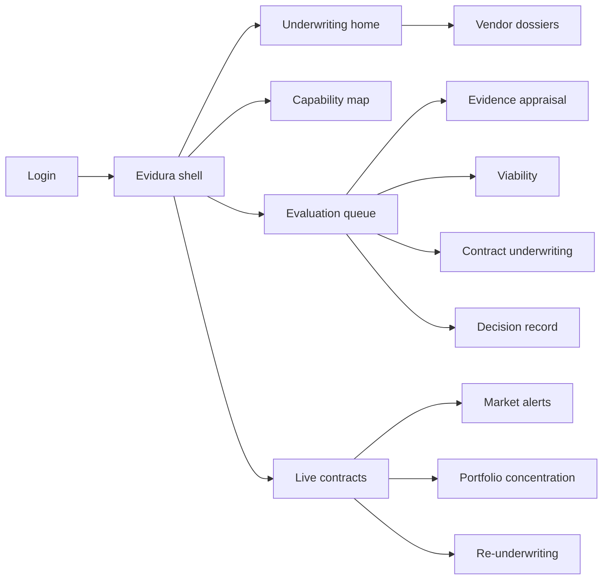
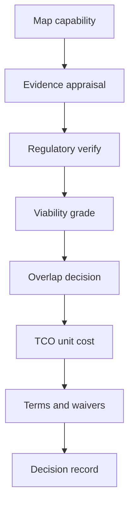

# Evidura — Web app

**Product:** [PRODUCT.md](./PRODUCT.md)
**Primary surface:** Health-AI vendor underwriting console (sourcing + clinical evaluation shell)
**Secondary surfaces:** Committee decision packet export; contract-owner alert acknowledgement inbox
**Design thesis:** Evidura is an underwriting desk for algorithms in a market that consolidates underneath five-year contracts — not a Gartner-style ratings lounge and not an innovation pilot tracker. The metaphor is credit analysis crossed with clinical evidence appraisal: every shortlist row carries a population-transfer distance and a seller viability grade, and contract clauses tighten as the grade weakens. Visual language is cool underwriting navy and escrow-green on pale bond paper — declines are archived as assets; waived protections glow as accepted risk. The Evidura wordmark sits on every decision record so the vote is about this buyer’s population and counterparty risk, not conference buzz.

## UX research synthesis

### Category peers (best-in-class)

- **EcoVadis / BitSight (third-party risk):** Continuous vendor posture with alerts when the counterparty changes. Steal: viability refreshed for contract life, not only at RFP; reject generic cyber scorecards as a substitute for model-evidence transfer.
- **Definitive Healthcare / PitchBook-style buyer research (health markets):** Ownership, funding, and acquisition exposure in one vendor dossier. Steal: consolidation events tied to exposed contracts; reject pure financial terminal UI without clinical evidence pane.
- **Covidence / DistillerSR (systematic review):** Structured evidence extraction with missing fields as findings. Steal: absence-recorded-as-finding appraisal; reject academic full-text review as the only clinician workflow.
- **Ariba / Coupa sourcing workspaces:** Decision records, dissent, overlap with incumbent spend. Steal: proceed/decline/defer with searchable declines; reject SKU shopping-cart metaphors for clinical algorithms.

### Patterns to adopt / reject

- **Adopt:** Buyer-owned capability taxonomy; population-match distance; viability-graded contract packs; mandatory conflict disclosure; data-use authorisation before PHI moves; cost per unit of work; market-event SLA to contract owners; portfolio concentration by vendor/owner/capability.
- **Reject:** Analyst star ratings as the decision; pilot-as-evaluation default; annual licence-only TCO; marketing-language categories; purple “innovation funnel” kanban as home.

### Trust, density, and workflow constraints from PRODUCT.md

Evidence appraisal must complete before any vote (BR-2). Regulatory status verified against authoritative register (BR-3). Viability is continuous (BR-4). Waived protections need named owners (BR-5). Overlap blocks duplicate buy without a decision (BR-6). Declines are retained (BR-7). PHI evaluation needs lawful basis first (BR-8). Undisclosed conflicts invalidate scores (BR-9). Clinicians have no protected time — pre-digest evidence, isolate judgement calls.

## Information architecture

### Nav model

### Roles → default home

| Role | Default home | Why |
|------|--------------|-----|
| Sourcing category manager | Underwriting home / eval queue | Cycle time and overlap (BR-6, BR-7) |
| Clinical evaluator | Evidence appraisal on assigned evals | Population transfer (BR-2) |
| Legal / TPRM | Contract underwriting + waivers | Viability-graded terms (BR-5) |
| Finance / actuarial | Cost model + concentration | Unit cost and portfolio risk (BR-10, BR-12) |
| Committee chair | Decision packet / vote | Documented outcomes (BR-7, BR-9) |
| Contract owner | Alerts inbox | Market events SLA (BR-11) |

### Cross-links to OpenAPI resources

| Nav area | OpenAPI tags / resources |
|----------|---------------------------|
| Capability categories and mappings | Market Map |
| Vendors, offerings, regulatory, intended-use | Vendors |
| Evidence items, population match | Evidence |
| Viability assessments, consolidation events | Viability |
| Evaluations, conflicts, scorecards, data-use, decisions | Evaluations |
| Contract terms, waivers, cost model, integration | Contracts |
| Overlap findings, concentration | Portfolio Overlap |
| Alerts, re-underwriting schedule | Alerts |

## Screen inventory

### Underwriting home

- **Purpose:** Answer “which evaluations are decision-ready, and which live contracts are exposed to market events?”
- **Entry:** Default for sourcing leadership.
- **Layout regions:** Brand; open evaluations by stage; overdue re-underwrites; unacknowledged alerts; concentration sparkline.
- **Primary actions:** Open eval; acknowledge alert; start evaluation from taxonomy.
- **Empty / loading / error:** Empty queue = healthy with next scheduled re-underwrites; alert feed error = SLA breach banner.
- **BR / story ties:** BR-4, BR-11, BR-12.

### Capability map

- **Purpose:** Buyer-owned taxonomy of clinical/financial jobs mapped to vendor marketing language.
- **Entry:** Market Map nav.
- **Layout regions:** Taxonomy tree; mapping table (vendor phrase → category); overlap heat by category spend.
- **Primary actions:** Add category; map phrase; open offerings in category.
- **Empty / loading / error:** Unmapped marketing terms queue for clinical co-owners.
- **BR / story ties:** BR-1.

### Vendor dossier

- **Purpose:** Single counterparty view: offerings, viability grade, ownership, acquisition exposure.
- **Entry:** Vendors nav; from eval.
- **Layout regions:** Viability grade header; funding/runway/concentration; offerings list; consolidation event timeline; under-contract flags.
- **Primary actions:** Refresh viability; open offering; link to exposed contracts.
- **Empty / loading / error:** Stale viability = amber “past refresh cadence.”
- **BR / story ties:** BR-4, BR-11.

### Evaluation workspace

- **Purpose:** Run one offering from shortlist to decision without losing dissent or declines.
- **Entry:** Evaluation queue create/open.
- **Layout regions:** Stage rail (taxonomy fit → evidence → regulatory → viability → overlap → cost → terms → vote); conflict disclosure gate; assignee list.
- **Primary actions:** Advance stage; record defer/decline early; attach data-use auth.
- **Empty / loading / error:** Missing conflict disclosures block scorecard submit (BR-9).
- **BR / story ties:** BR-7, BR-8, BR-9.

### Evidence appraisal

- **Purpose:** Structured transfer assessment; missing elements are findings, not blanks.
- **Entry:** Eval → Evidence.
- **Layout regions:** Study design/population fields; distance-to-buyer; prevalence/operating-point note; calibration; subgroups; findings list for absences; pre-digested summary for clinicians.
- **Primary actions:** Score transfer; mark finding; request vendor artefact.
- **Empty / loading / error:** No evidence package = cannot reach vote (BR-2).
- **BR / story ties:** BR-2; clinical evaluator stories.

### Regulatory and intended use

- **Purpose:** Verify clearance against authoritative register vs buyer workflow/population.
- **Entry:** Eval or offering regulatory tab.
- **Layout regions:** Verified status; intended-use comparison; escalation for beyond-clearance use.
- **Primary actions:** Confirm match; escalate acceptance; block purchase pending acceptance.
- **Empty / loading / error:** Unverified marketing claim = blocked status.
- **BR / story ties:** BR-3.

### Viability assessment

- **Purpose:** Grade seller survival through contract term; drive term strength.
- **Entry:** Eval → Viability; vendor dossier.
- **Layout regions:** Grade factors; acquisition exposure; support depth; recommended protection pack preview.
- **Primary actions:** Save assessment; schedule refresh; push terms template.
- **Empty / loading / error:** Incomplete factors = provisional grade labelled as such.
- **BR / story ties:** BR-4, BR-5.

### Contract underwriting

- **Purpose:** Viability-graded protective terms with explicit waivers.
- **Entry:** Eval → Terms; live contract maintenance.
- **Layout regions:** Clause checklist (escrow, portability, transition, change-of-control, price protection, performance remedies, retraining, surveillance duties); waiver form with named owner.
- **Primary actions:** Apply pack; waive with risk acceptance; export redlines briefing.
- **Empty / loading / error:** High-risk viability with empty protections = blocking warning.
- **BR / story ties:** BR-5.

### Cost model

- **Purpose:** TCO including integration, clinician time, validation, monitoring, exit — as cost per unit of work.
- **Entry:** Eval → Cost; finance view.
- **Layout regions:** Licence vs all-in; unit-of-work denominator; sensitivity to exit.
- **Primary actions:** Present to committee; compare overlap incumbents.
- **Empty / loading / error:** Licence-only incomplete model flagged.
- **BR / story ties:** BR-10.

### Overlap and concentration

- **Purpose:** Stop duplicate buys; show portfolio consolidation risk.
- **Entry:** Portfolio Overlap; before vote gate.
- **Layout regions:** Overlap findings with incumbent spend; concentration by vendor/owner/capability; required decision before proceed.
- **Primary actions:** Decide proceed/consolidate/decline duplicate; open concentration drill-down.
- **Empty / loading / error:** No overlap = clear path indicator.
- **BR / story ties:** BR-6, BR-12.

### Decision record

- **Purpose:** Proceed / proceed with conditions / decline / defer with rationale, dissent, evidence relied upon.
- **Entry:** Final eval stage; searchable decisions archive.
- **Layout regions:** Outcome; rationale; dissent; evidence links; conflict re-check; packet export.
- **Primary actions:** Record vote; invalidate on late conflict discovery; search prior declines.
- **Empty / loading / error:** Re-vote required state after conflict invalidation (BR-9).
- **BR / story ties:** BR-7, BR-9.

### Market alerts and re-underwriting

- **Purpose:** Acquisition, funding failure, discontinuation, recall, clearance change → contract owners within SLA.
- **Entry:** Contract owner default; Alerts nav.
- **Layout regions:** Alert queue; exposed contracts + protective terms; acknowledgement; re-underwriting schedule (overdue filter).
- **Primary actions:** Acknowledge; open terms; trigger re-underwrite.
- **Empty / loading / error:** SLA breach list when unacknowledged past threshold.
- **BR / story ties:** BR-4, BR-11.

## Key flows

1. **Underwrite to vote** — map to taxonomy → evidence appraisal → regulatory verify → viability grade → overlap decision → cost model → terms/waivers → conflict disclosures → decision record; failure: missing evidence or conflicts blocks vote.

2. **PHI evaluation authorisation** — lawful basis + agreement + minimisation + disposition recorded → then data may move; failure: block sample transfer.

3. **Market event response** — consolidation/recall alert → list exposed contracts and protections → owner ack within SLA → re-underwrite or invoke terms.

4. **Decline reuse** — search prior decline → attach prior rationale → skip zero-base re-eval or explicitly reopen with new evidence.

5. **Waiver acceptance** — propose waive protection → named owner + risk text → committee visibility → retained on contract.

## Design system

### Tokens (CSS variables)

- `--color-ink: #142033` — primary text
- `--color-bond: #F2F4F7` — app ground (cool bond paper)
- `--color-panel: #FFFFFF` — panels with navy hairlines
- `--color-navy: #1B3A5C` — underwriting chrome / brand
- `--color-escrow: #2F7D6D` — protections in force / ack complete
- `--color-risk-amber: #C4891A` — provisional viability / overdue re-underwrite
- `--color-waiver: #B33A2B` — waived protection / accepted risk
- `--color-decline-slate: #5A6675` — archived decline (asset, not shame)
- `--color-brand: #1B3A5C` — Evidura wordmark
- `--font-display: "Fraunces", serif` — viability grades and decision outcomes
- `--font-body: "IBM Plex Sans", sans-serif`
- `--font-mono: "IBM Plex Mono", monospace` — contract ids, clearance numbers, SLA clocks
- `--space-1`…`--space-8`: 4px scale
- `--radius-sm: 4px`; `--radius-md: 8px`
- `--motion-stamp: 200ms ease-out` — decision stamp
- `--motion-alert: 220ms ease-in-out` — new market-event pulse
- `--motion-waiver: 180ms ease-out` — waiver risk highlight
- Atmosphere: faint ledger column rules; no startup gradient hero; committee packet print stylesheet with wordmark.

### Typography & brand

- Display for grades and vote outcomes; body for appraisals; mono for clauses and ids.
- Brand on every decision packet and alert acknowledgement screen.
- Login: brand-first; headline (“Underwrite the algorithm and the seller”); one CTA.

### Do / don’t

- **Do:** Record absences as findings; retain declines; grade-link terms; disclose conflicts in-flow; show unit cost.
- **Don’t:** Star-rating home; pilot kanban as underwriting; hide waivers; purple AI market charts as the product metaphor.

### Accessibility & domain trust cues

- AA+ contrast; waived protections use text + icon.
- Live regions for SLA-critical alerts.
- Focus order in eval: conflicts → evidence gaps → vote.
- Vendor-facing surfaces (if any) never see peer scorecards.

## Component patterns

- **CapabilityTaxonomyNode** — buyer job definition with vendor-phrase mappings.
- **EvidenceFindingRow** — missing study element as explicit finding.
- **PopulationMatchMeter** — distance from buyer population + prevalence note.
- **ViabilityGradeSeal** — grade driving term pack.
- **ProtectionWaiver** — named-owner accepted risk.
- **OverlapSpendCompare** — candidate vs incumbent attached spend.
- **DecisionStamp** — proceed/conditions/decline/defer with dissent.
- **MarketEventAlert** — event type + exposed contracts + ack SLA.

## Out of scope for v1 web

- Public ratings marketplace; vendor CRM for sellers’ sales teams; full CLM authoring/redline IDE; running production models; member/patient apps; GPO white-label portals beyond packet export; live trading of vendor securities.
